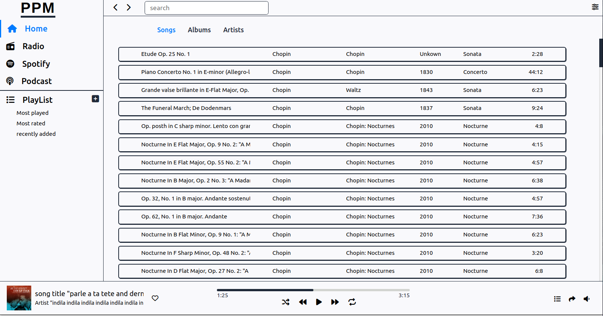

# PPM (Under Development)
g Coded In C++ with minimal dependencies as possible  and Various GUI Options.



## Features

- 
```bash
 # Underway
``` 

## Dependencies

## Installing PPM

## Building from source

## Future plan

## Thanks to


## Contributing
Pull requests are welcome. For major changes, please open an issue first to discuss what you would like to change.

Please make sure to update tests as appropriate.

## Feedback

Send Me Mail
   [mail](mahmoudaboattia1999@gmail.com)

## License
Copyright (c) Pyramido. All rights reserved.

Licensed under the [MIT](https://choosealicense.com/licenses/mit/) license.
